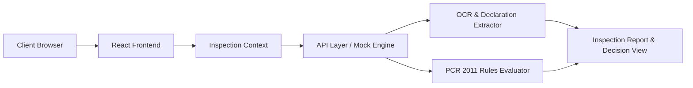

# PackGuard: Legal Metrology Compliance Inspection System

PackGuard is an inspection and enforcement web application for verifying mandatory declarations on packaged commodities under the Legal Metrology (Packaged Commodities) Rules 2011.

Inspectors can upload product package images (Principal Display Panel, declaration panels, side labels), extract statutory declarations (MRP, Net Quantity, Manufacturer details, Consumer Care), evaluate rule compliance, review evidence flags, and generate official verification reports.

## Live Deployment

- Hosted Frontend: https://packguard-frontend.vercel.app

## Architecture Overview



## Core Features

- Enforcement Dashboard: Overview metrics for total inspections, compliance rates, review queues, and activity logs.
- Image Intake and Presets: Multi-panel package image uploader with pre-loaded demo inspection presets.
- Declaration Extraction: Automated detection of mandatory package labels (MRP, Net Qty, Manufacturer, Date, Helpline).
- Statutory Rule Evaluation: Real-time checks against Legal Metrology Rules 2011 thresholds and formatting standards.
- Official Report Generation: Printable compliance verification reports with certificate formatting.
- Inspection Registry: Searchable and filterable history log by status, category, and date.

## Technology Stack

- Frontend: React, Vite, TypeScript, Tailwind CSS
- Routing: React Router DOM
- State Management: React Context API, TanStack React Query
- Icons: Lucide React
- Network: Axios
- Deployment: Vercel (Single Page Application configuration)

## Local Development

1. Install dependencies:
```bash
npm install
```

2. Start the development server:
```bash
npm run dev
```

3. Build for production:
```bash
npm run build
```

## Vercel Deployment

The frontend is configured for deployment on Vercel via `vercel.json` with Single Page Application rewrites to `index.html`.
